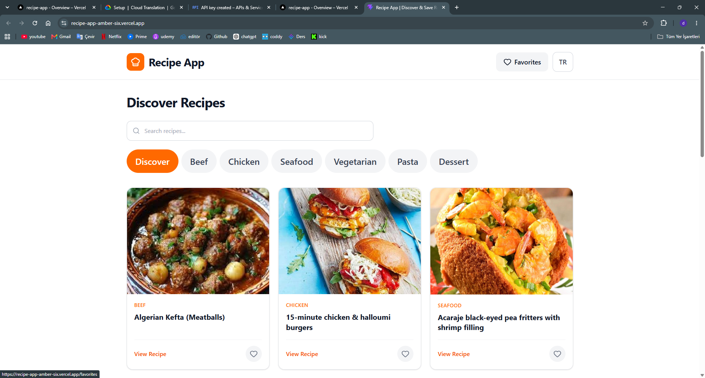
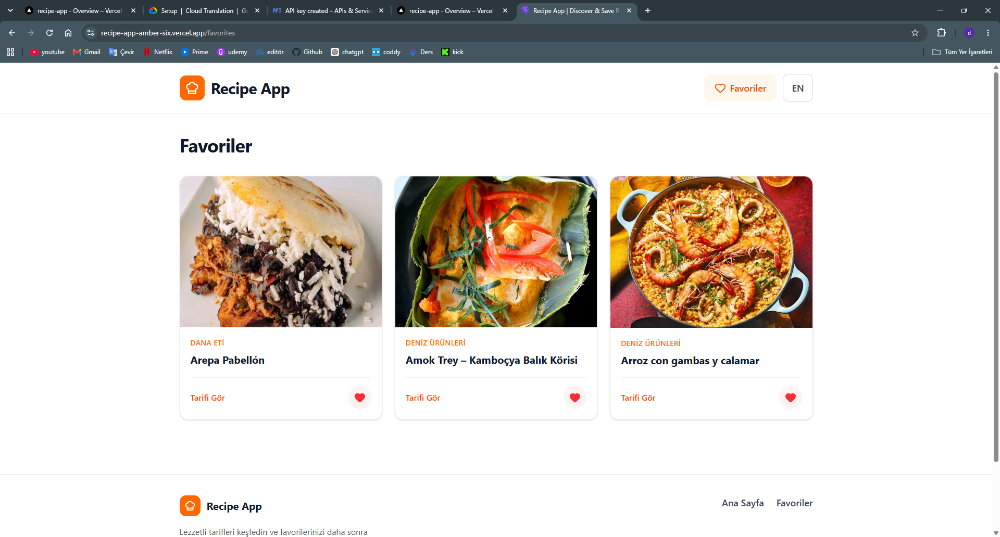
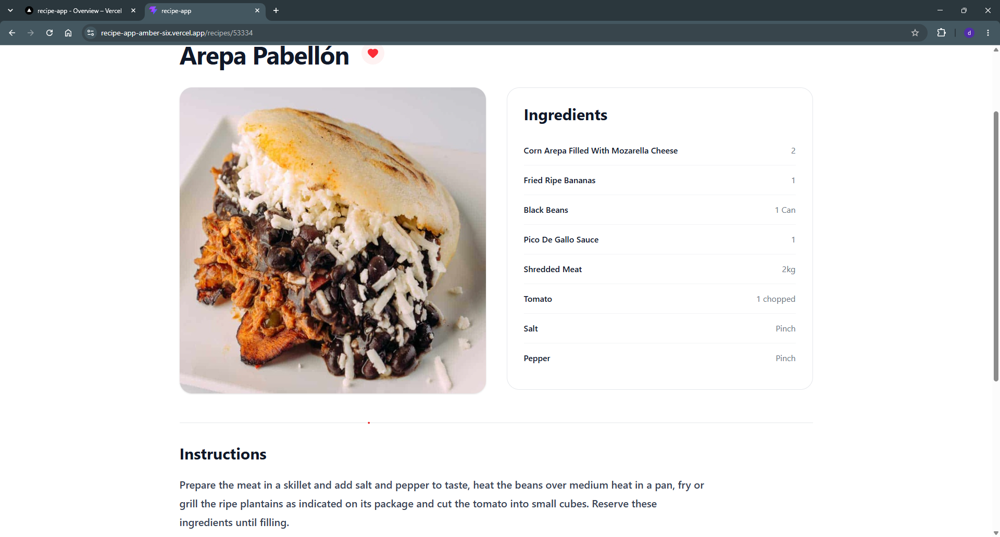
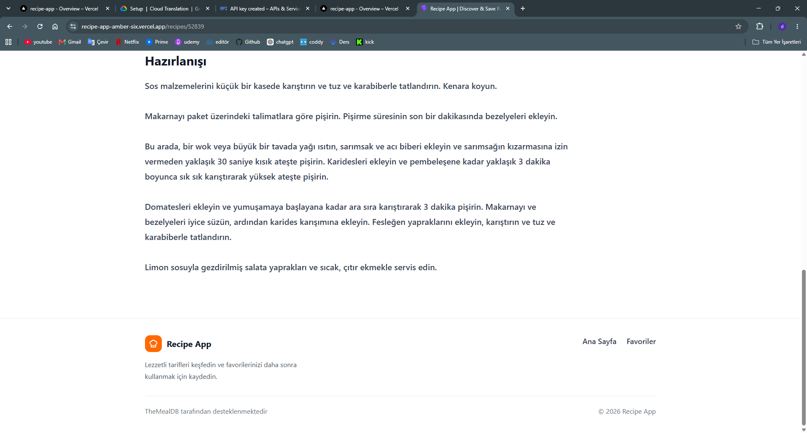

# Recipe App

A responsive recipe discovery application built with React and Vite.

Recipe App allows users to discover recipes, search by recipe name, browse categories, save favorites, view detailed cooking instructions, and switch between English and Turkish.

Dynamic recipe content is translated using Google Cloud Translation.

## Live Demo

[View the Live Application](https://recipe-app-amber-six.vercel.app)

## Features

- Discover recipes from multiple categories
- Search recipes by name
- Browse recipes by category
- Paginated search and category results
- View detailed recipe information
  - Ingredients
  - Measurements
  - Cooking instructions
  - Cuisine / origin
- Add and remove favorite recipes
- Persist favorites with `localStorage`
- English and Turkish language support
- Dynamic recipe translation with Google Cloud Translation
- Translate Turkish search queries before querying TheMealDB
- Responsive design for desktop, tablet, and mobile
- Accessible buttons, navigation, focus states, and semantic markup
- Loading, empty, error, and not-found states
- Client-side routing with direct route support
- Production deployment with Vercel

## Screenshots

### Home



### Favorites



### Turkish Recipe Details



### Turkish Cooking Instructions



## Tech Stack

### Frontend

- React
- Vite
- JavaScript
- Tailwind CSS
- React Router
- Lucide React

### State Management & Data Fetching

- TanStack Query
- React Context
- `useReducer`
- `localStorage`
- Axios

### APIs

- TheMealDB
- Google Cloud Translation API

### Testing & Tooling

- Vitest
- React Testing Library
- ESLint

### Deployment

- Vercel
- Vercel Serverless Functions

## Architecture

The application separates server state, client state, API communication, and presentation responsibilities.

- **TanStack Query** manages remote data such as recipes and translations.
- **Context + useReducer** manages favorite recipes.
- **Custom hooks** encapsulate search, recipe queries, language state, and translation logic.
- **API modules** handle communication with TheMealDB and the translation endpoint.
- **Vercel Serverless Functions** keep the Google Translation API key outside the client bundle.
- **Reusable components** handle recipe cards, grids, pagination, favorite controls, navigation, and other UI elements.

## Project Structure

```text
recipe-app/
├── api/
│   └── translate.js
├── public/
├── screenshots/
│   ├── favorites-tr.png
│   ├── home.png
│   ├── recipe-detail-tr.png
│   └── recipe-instructions-tr.png
├── src/
│   ├── api/
│   ├── components/
│   ├── constants/
│   ├── contexts/
│   ├── hooks/
│   ├── pages/
│   └── test/
├── .gitignore
├── index.html
├── package.json
├── vercel.json
└── vite.config.js
```

## Getting Started

Clone the repository:

```bash
git clone https://github.com/Dogukan3648/recipe-app.git
```

Navigate to the project directory:

```bash
cd recipe-app
```

Install dependencies:

```bash
npm install
```

Start the development server:

```bash
npm run dev
```

## Environment Variables

Dynamic translation uses the Google Cloud Translation API.

The serverless translation endpoint expects the following environment variable:

```env
GOOGLE_TRANSLATE_API_KEY=your_api_key
```

Do not expose the API key in client-side code or commit it to the repository.

> The standard Vite development server does not execute the Vercel Serverless Function located in `/api`. The complete translation flow is available in the deployed Vercel environment.

## Available Scripts

Start the development server:

```bash
npm run dev
```

Run ESLint:

```bash
npm run lint
```

Run the test suite:

```bash
npm test -- --run
```

Create a production build:

```bash
npm run build
```

Preview the production build:

```bash
npm run preview
```

## Testing

The project includes focused tests for favorite recipe behavior and reducer logic.

Covered scenarios include:

- Adding a recipe to favorites
- Preventing duplicate favorites
- Removing a recipe from favorites
- Adding a favorite through the UI
- Removing a favorite through the UI

## Translation Flow

When Turkish is selected:

1. Static interface text is loaded from local translation constants.
2. Recipe titles and detail content are translated through the serverless translation endpoint.
3. Turkish search queries are translated to English before being sent to TheMealDB.
4. The original recipe data is preserved so switching back to English restores the source content.

Translation requests are validated by the serverless endpoint before being forwarded to Google Cloud Translation.

## Data Source

Recipe data and images are provided by [TheMealDB](https://www.themealdb.com/).

## Author

Developed by **Dogukan3648**.
